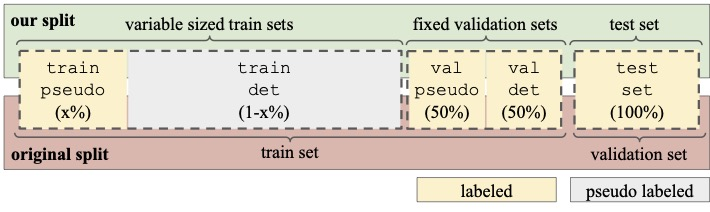

# Training Downstream Detector
Directory forked from [mmdetection3d](https://github.com/open-mmlab/mmdetection3d/). It is adapted to load feather files as input for training and evaluation on pointpillars model. The performance is automatically evaluated using the evaluation code from SeMoLi. For training we use the standard hyperparameters for pointpillars training on Waymo Open Dataset. We support training on Waymo Open Dataset and Argoverse2 dataset. During training and evaluation we only use points and labels within a ```100mx40m``` rectangle around the ego-vehicle.

## Installation
If you installed the conda environment from SeMoLi, all libraries are already installed and you can run the code if you activate ```conda activate SeMoLi```. Otherwise, perpare a conda evironment running the following:

```
conda create -n mmdetection3d python=3.9
conda activate mmdetection3d
bash setup.sh
```

## Running the code
In this repository we follow the data split convention of SeMoLi given by:


### Set Data Variables
For training and evaluation, you can use either pseudo-labels stored in a feather file or ground truth labels loaded from a feather file. et the train and validation label paths to the corresponding feather file by running:
```
export TRAIN_LABELS=<train_label_path>
export VAL_LABELS=<val_label_path>
```

For validation, set the path to the feather file containing ground truth data. If you want to use the ```val_detector``` dataset from SeMoLi for evaluation, set the path to the feather file containing ground truth *training data*. If you want to use the *real validation set*, i.e., the ```val_evaluation``` split set the path to the file containing validation set ground truth data. 

#### Waymo Open Dataset
For example, if you are using this repository within the SeMoLi repository, the ground truth train and real validation set paths for Waymo Open Dataset can be set by:

```
export TRAIN_LABELS=../SeMoLi/data_utils/Waymo_Converted_filtered/train_1_per_frame_remove_non_move_remove_far_filtered_version_city_w0.feather
export VAL_LABELS=../SeMoLi/data_utils/Waymo_Converted_filtered/val_1_per_frame_remove_non_move_remove_far_filtered_version_city_w0.feather
```

#### AV2
For AV2 dataset the paths can be set to 
```
export TRAIN_LABELS=../SeMoLi/data_utils/AV2_filtered/train_1_per_frame_remove_non_move_remove_far_filtered_version_city_w0.feather
export VAL_LABELS=../SeMoLi/data_utils/AV2_filtered/val_1_per_frame_remove_non_move_remove_far_filtered_version_city_w0.feather
```

### Training and Evaluation
The base command for training and evaluation on Waymo Open Dataset is given by:

#### Class Agnostic Training and Evaluation
```
./tools/dist_train.sh configs/pointpillars/pointpillars_hv_secfpn_sbn-all_8xb4-2x_waymo-3d-class_agnostic.py <num_gpus> <percentage_train> <percentage_val> $TRAIN_LABELS $VAL_LABELS --eval --val_detection_set=val_evaluation --auto-scale-lr
```
where
- ```num_gpus``` is the number of GPUs that are used for the training
- ```percentage_train``` is the percentage of training data you want to use for training according to SeMoLi splits, i.e., percentage_train corresponds to x in the above figure. Hence if ```x=0.1``` and the split is ```train_detector```, the actual percentage of the data used is ```1-0.1=0.9```
- ```percentage_val``` is 1.0 if you want to use either ```val_detector``` or the real validation set ```val_evaluation```. If you want to use any part of the ```train_detector``` or ```train_gnn``` for evaluation, please set the percentage according to SeMoLi
- ```eval``` if eval is set, you will only evaluate and not train
- ```val_detection``` determines the detection split you want to use, i.e., ```val_detector``` or the real validation set ```val_gnn```
- ```auto-scale-lr``` adapts the learning rate to the batch size according to a given base learning rate

#### Labeled and Unlabeled Data

If you want to use labeled and unlabeled data together, set the train data path to the pseudo labels and set a second path for the labeled data:

```
export TRAIN_LABELS=<path_to_pseudo_labels>
export TRAIN_LABELS2=../SeMoLi/data_utils/AV2_filtered/train_1_per_frame_remove_non_move_remove_far_filtered_version_city_w0.feather
```
Then run the following:
```
./tools/dist_train.sh configs/pointpillars/pointpillars_hv_secfpn_sbn-all_8xb4-2x_waymo-3d-class_agnostic.py <num_gpus> <percentage_train> <percentage_val> $TRAIN_LABELS $VAL_LABELS --label_path2 $TRAIN_LABELS2--val_detection_set=val_evaluation --auto-scale-lr

```
#### AV2 Dataset Training and Evaluation
For AV2 dataset set the dataset paths as above and change the config file to ```configs/pointpillars/pointpillars_hv_secfpn_sbn-all_8xb4-2x_av2-3d-class_agnostic.py```:
```
./tools/dist_train.sh configs/pointpillars/pointpillars_hv_secfpn_sbn-all_8xb4-2x_av2-3d-class_agnostic.py <num_gpus> <percentage_train> <percentage_val> $TRAIN_LABELS $VAL_LABELS --val_detection_set=val_evaluation --auto-scale-lr
```

#### Class Specific Training (only for Waymo Open Dataset currently)
For training in a class specific setting with ground truth data, change the config file to ```pointpillars_hv_secfpn_sbn-all_8xb4-2x_waymo-3d-class_specific.py ```

```
./tools/dist_train.sh configs/pointpillars/pointpillars_hv_secfpn_sbn-all_8xb4-2x_waymo-3d-class_specific.py <num_gpus> <percentage_train> <percentage_val> $TRAIN_LABELS $VAL_LABELS --val_detection_set=val_evaluation --auto-scale-lr
```

